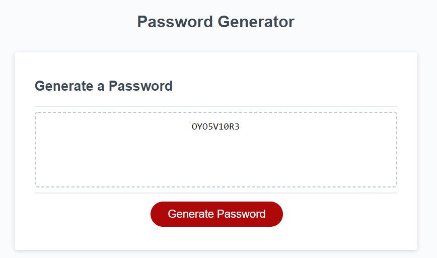

# 03 JavaScript: Password Generator

LINK TO WEBSITE: https://nickpasch.github.io/Homework3PasswordGenerator/

In this website, I used javascript to create a random password that fit the users critera. The user decides how many characters, between 8 and 128, they want in their password. Then they decide what combination of characters they want. They can include any combination of lowercase characters, uppercase characters and numbers. After they have decided which types of characters they want, they choose how many they want of each. 

